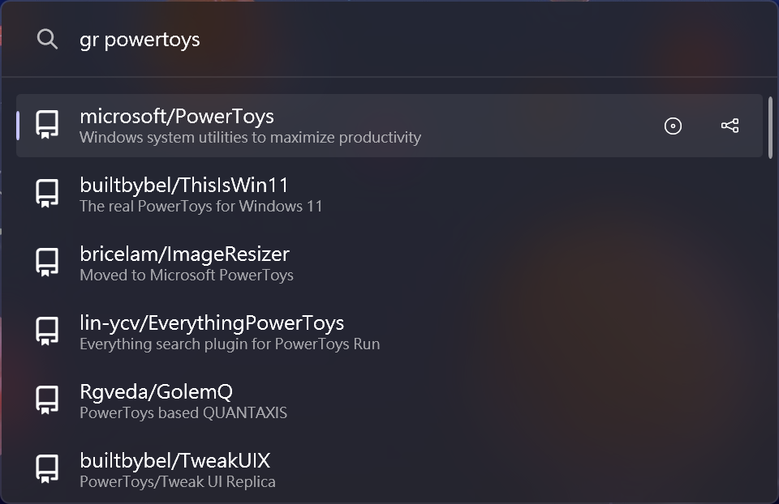
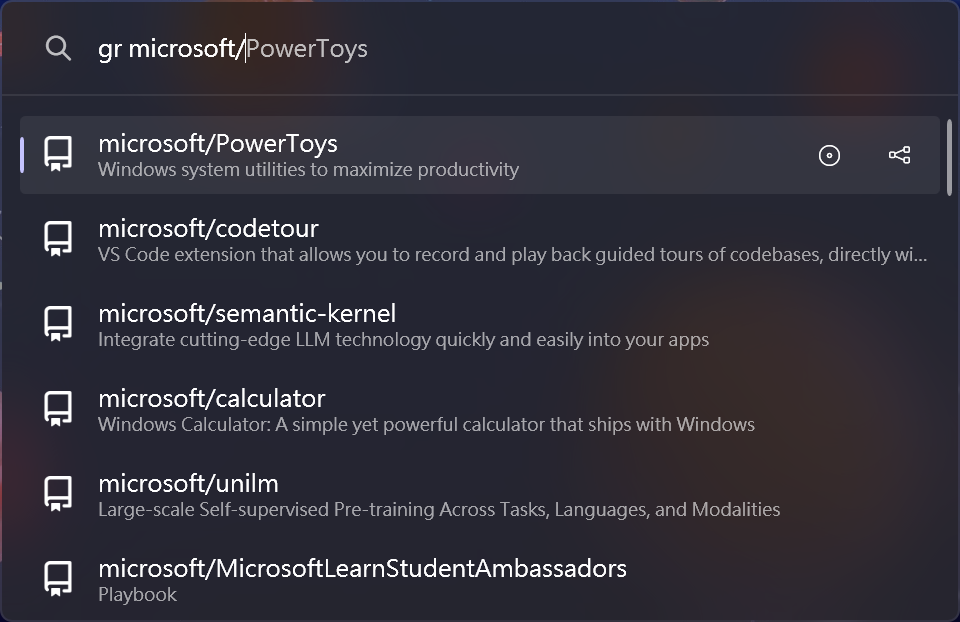
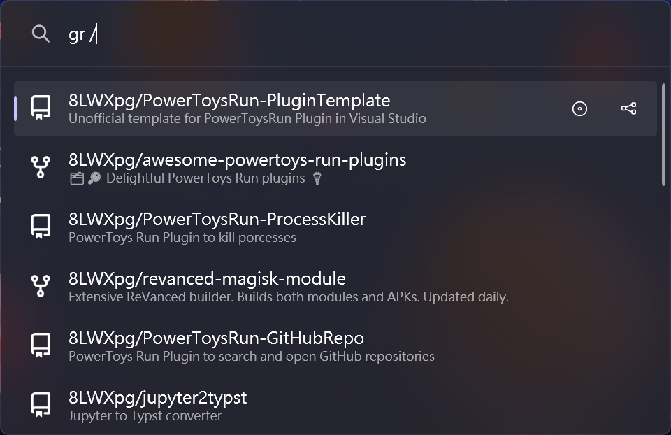
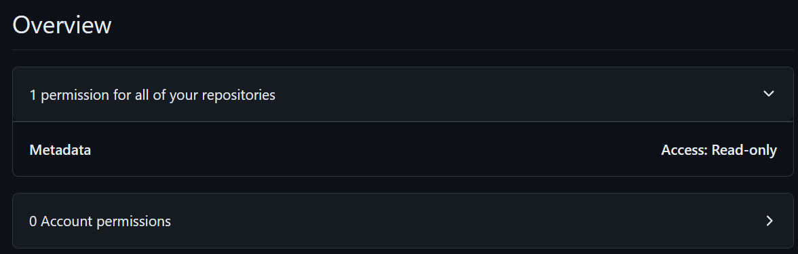

# GitHubRepo Plugin for PowerToys Run

This is a plugin for [PowerToys Run](https://aka.ms/PowerToysOverview_PowerToysRun) that allows to search for GitHub repositories then open in your default browser.

Checkout the [Template](https://github.com/8LWXpg/PowerToysRun-PluginTemplate) for a starting point to create your own plugin.

## Features

### Search repo with query: `query`

### Search repo with user: `user/repo`

### Search repo with default user: `/repo`

If authtoken is set, it will list all the repositories the token has access to. Otherwise,
it will list all the public repositories of the default user.

### Context menu

- **Open issues**: Open the issues page of the repository <kbd>Ctrl+I</kbd>.
- **Open pull requests**: Open the pull requests page of the repository <kbd>Ctrl+P</kbd>.

### Settings

- **Default user**: The default user to search for when typed `/`.
- **GitHub auth token** (optional): The GitHub auth token to use for better rate limiting and access to private repo.
  You can generate a fine-grained token with read access to metadata. Detailed instructions
  [here](https://docs.github.com/en/authentication/keeping-your-account-and-data-secure/managing-your-personal-access-tokens#creating-a-fine-grained-personal-access-token).

## Installation

1. Download the latest release of the from the releases page.
2. Extract the zip file's contents to `%LocalAppData%\Microsoft\PowerToys\PowerToys Run\Plugins`
3. Restart PowerToys.

## Usage

1. Open PowerToys Run (default shortcut is <kbd>Alt+Space</kbd>).
2. Type `gr` followed by your search query.
3. Select a search result and press `Enter` to open it in browser.

## Building

1. Clone the repository and the dependencies in `/lib`.
2. run `dotnet build -c Release`.

## Debugging

1. Clone the repository and the dependencies in `/lib`.
2. Build the project in `Debug` configuration.
3. Make sure you have [gsudo](https://github.com/gerardog/gsudo) installed in the path.
4. Run `debug.ps1` (change `$ptPath` if you have PowerToys installed in a different location).
5. Attach to the `PowerToys.PowerLauncher` process in Visual Studio.

## Contributing

### Localization

If you want to help localize this plugin, please check the [localization guide](./Localizing.md)
